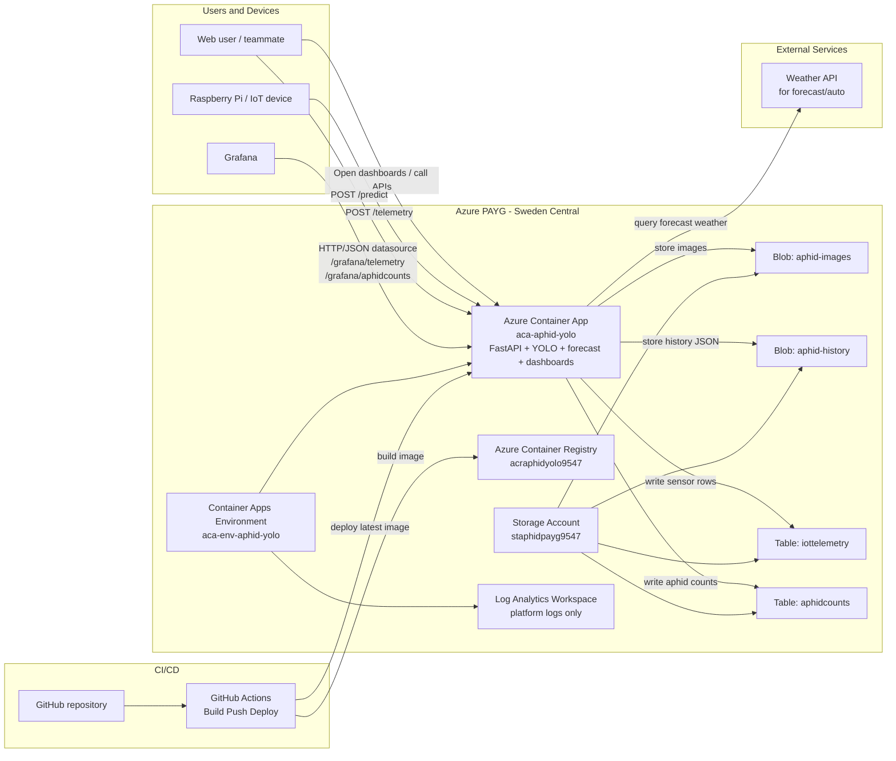
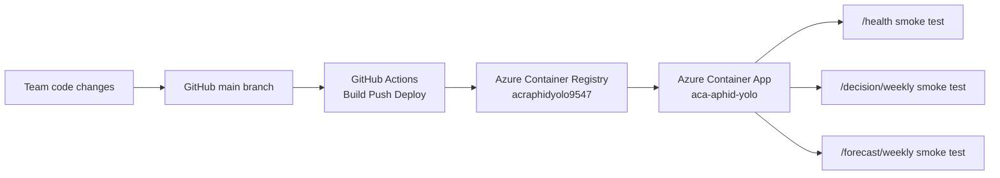

# 当前项目 Azure 架构图（答辩版）

这份文档是给答辩直接用的。
重点不是讲所有技术细节，而是让老师或评委在 1 到 2 分钟内看懂：

- 我们的系统部署在 Azure PAYG 上
- 图像识别、传感器上传、历史存储、预测、决策和 Grafana 已经连成一条链
- GitHub Actions 可以自动部署到当前 Azure 环境

## 1. 当前真实 Azure 资源

当前项目运行在新的 PAYG 订阅中，核心资源如下：

- Resource Group: `rg-aphid-yolo-payg`
- Region: `swedencentral`
- Container App: `aca-aphid-yolo`
- Container Apps Environment: `aca-env-aphid-yolo`
- Container Registry: `acraphidyolo9547`
- Storage Account: `staphidpayg9547`
- Log Analytics Workspace: `workspace-rgaphidyolopaygK1ST`

当前线上 API 地址：

`https://aca-aphid-yolo.salmonforest-9615860e.swedencentral.azurecontainerapps.io`

## 2. 可直接展示的正式图

我已经生成了一版更适合展示的架构图：

- FigJam 链接：
  `https://www.figma.com/online-whiteboard/create-diagram/31045034-a4ca-4aea-8efa-605d8f391eec?utm_source=chatgpt&utm_content=edit_in_figjam&oai_id=&request_id=6a81f889-8012-4c2e-b1bd-4802e59acce1`

如果你答辩时想要“看起来更像正式云架构图”，优先用这张。

## 3. 运行架构图（Mermaid 版）

## 4. 这一张图答辩时怎么讲

你可以按这个顺序讲：

1. 用户或设备先进入系统。
2. 用户上传虫子图片，Raspberry Pi 上传温湿度等传感器数据。
3. 所有业务逻辑都由 Azure Container App 里的 FastAPI 服务处理。
4. 图片识别结果和历史记录会写进 Blob，传感器和虫量记录会写进 Azure Table。
5. 自动预测会额外参考未来天气信息。
6. Grafana 现在不是直接查 Azure Table，而是通过我们自己提供的 API 接口读取数据。
7. 整个系统的更新由 GitHub Actions 自动完成，镜像先推到 ACR，再部署到 Container App。

一句话版：

> 我们把图像识别、环境采集、历史存储、预测决策和可视化全部部署在 Azure PAYG 上，并且打通了从 GitHub 到 Azure 的自动部署链路。

## 5. 部署链路图（答辩可选）

如果老师更关心“这个系统是不是工程化部署的”，可以再补这张图。

## 6. 老师最容易听懂的三个亮点

- 这不是单一模型，而是一整套系统。
- 云端已经有真实部署，不只是本地 notebook 演示。
- 可视化、API、存储和自动部署都已经打通。

## 7. 你答辩时不要说过头的地方

建议这样说：

- 这是一个“可运行的原型系统”
- 已经可以演示完整链路
- 但真实业务数据量、长期稳定性和生产级鲁棒性还有继续优化空间

不建议直接说：

- 已经是生产级系统
- 已经完成大规模真实场景验证

这样会更稳，也更可信。
